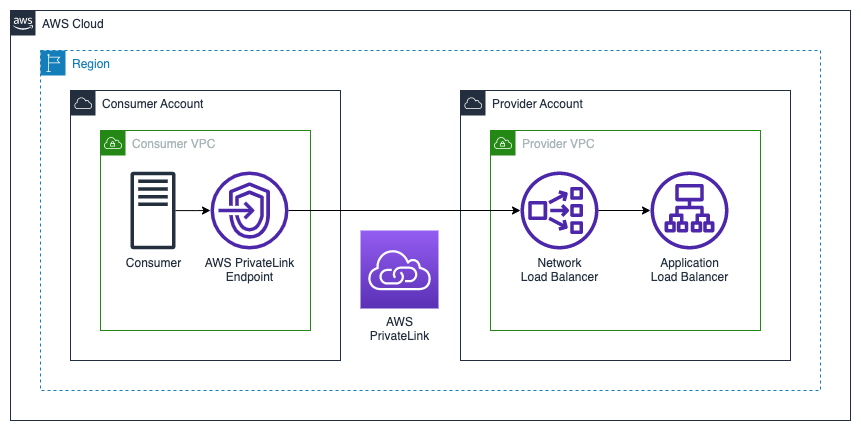
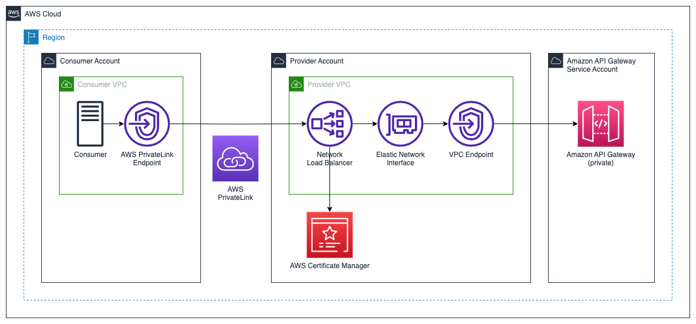

# AWS PrivateLink Reference Architectures

### Table of contents

- [AWS PrivateLink Reference Architectures](#aws-privatelink-reference-architectures)
    - [Table of contents](#table-of-contents)
  - [Introduction](#introduction)
      - [What are the benefits of using a VPC endpoint with AWS PrivateLink?](#what-are-the-benefits-of-using-a-vpc-endpoint-with-aws-privatelink)
  - [Architectures](#architectures)
    - [Network Load Balancer -\> Application Load Balancer](#network-load-balancer---application-load-balancer)
    - [Network Load Balancer -\> Private API Gateway](#network-load-balancer---private-api-gateway)
  - [Prerequisites](#prerequisites)
  - [Tools and services](#tools-and-services)
  - [Usage](#usage)
      - [Parameters](#parameters)
      - [Installation](#installation)
  - [Clean up](#clean-up)
  - [Reference](#reference)
  - [Contributing](#contributing)
  - [License](#license)

## Introduction

This project provides reference implementations for [AWS PrivateLink](https://aws.amazon.com/privatelink/) with an [Application Load Balancer](https://aws.amazon.com/elasticloadbalancing/application-load-balancer/) (ALB) or an [Amazon API Gateway](https://aws.amazon.com/api-gateway/). Implementations are provided in both [AWS CloudFormation](https://aws.amazon.com/cloudformation/) and [Hashicorp Terraform](https://www.terraform.io/) templates.

#### What are the benefits of using a VPC endpoint with AWS PrivateLink?

VPC endpoints provide secure access to a specific service, with several benefits to the end user:

- VPC endpoints provide access to a specific service without the need of using any other gateways – no need to use an Internet gateway, a NAT gateway, a VPN connection, or a VPC peering connection, reducing the risks of exposing your resources to the Internet or to other outside networks.
- Your traffic remains within Amazon's private network, reducing the risks of exposing your traffic to the Internet.
- When accessing Amazon services over VPC endpoints, you can restrict the access through a VPC endpoint to specific users, actions, and/or resources.
- You can limit access to resources provided by an Amazon service to traffic originating from a specific VPC or through a specific VPC endpoint.

## Architectures

### Network Load Balancer -> Application Load Balancer



In this architecture, the provider has an existing Internet-facing ALB servicing existing consumers. The templates in this reposititory deploy a [Network Load Balancer](https://aws.amazon.com/elasticloadbalancing/network-load-balancer/) into private subnets within the same VPC and availabiilty zones (AZs) as the ALB. An NLB [target group](https://docs.aws.amazon.com/elasticloadbalancing/latest/network/load-balancer-target-groups.html) is created with the ALB as a single target. An AWS PrivateLink [endpoint service](https://docs.aws.amazon.com/vpc/latest/privatelink/create-endpoint-service.html) is created targeting the NLB.

### Network Load Balancer -> Private API Gateway



In this architecture, the provider may have an existing edge or regional API Gateway or an existing [private API Gateway](https://docs.aws.amazon.com/apigateway/latest/developerguide/apigateway-private-apis.html) servicing existing consumers. A private API is required to provide connectivity through AWS PrivateLink. The templates in this repository deploy a [Network Load Balancer](https://aws.amazon.com/elasticloadbalancing/network-load-balancer/) into private subnets within the same VPC and availabiity zones (AZs) as the [interface VPC endpoint for API Gateway](https://docs.aws.amazon.com/apigateway/latest/developerguide/apigateway-private-apis.html#apigateway-private-api-create-interface-vpc-endpoint). An NLB [target group](https://docs.aws.amazon.com/elasticloadbalancing/latest/network/load-balancer-target-groups.html) is created with VPC endpoint elastic network interfaces (ENIs) as the TLS targets. [AWS Certificate Manager](https://aws.amazon.com/certificate-manager/) is used to create a TLS certificate that is associated to both the NLB and API Gateway.

## Prerequisites

- [Python 3](https://www.python.org/downloads/), installed
- [AWS Command Line Interface (AWS CLI)](https://docs.aws.amazon.com/cli/latest/userguide/install-cliv2.html) version 2, installed. Please follow these instructions with how to [setup your AWS credentials](https://docs.aws.amazon.com/serverless-application-model/latest/developerguide/serverless-getting-started-set-up-credentials.html).
- [AWS Serverless Application Model (SAM)](https://docs.aws.amazon.com/serverless-application-model/latest/developerguide/serverless-getting-started.html), installed
- [Docker Desktop](https://www.docker.com/products/docker-desktop), installed
- [GitHub](https://github.com) account

## Tools and services

- [Amazon API Gateway](https://aws.amazon.com/api-gateway/) - Amazon API Gateway is a fully managed service that makes it easy for developers to create, publish, maintain, monitor, and secure APIs at any scale.
- [AWS Certificate Manager](https://aws.amazon.com/certificate-manager/) - Provision and manage SSL/TLS certificates with AWS services and connected resources.
- [AWS CloudFormation](https://aws.amazon.com/cloudformation/) - AWS CloudFormation lets you model, provision, and manage AWS and third-party resources by treating infrastructure as code.
- [AWS PrivateLink](https://aws.amazon.com/privatelink/) - Establish connectivity between VPCs and AWS services without exposing data to the internet
- [Application Load Balancer](https://aws.amazon.com/elasticloadbalancing/application-load-balancer/) - Application Load Balancer operates at the request level (layer 7), routing traffic to targets (EC2 instances, containers, IP addresses, and Lambda functions) based on the content of the request.
- [Network Load Balancer](https://aws.amazon.com/elasticloadbalancing/network-load-balancer/) - Network Load Balancer operates at the connection level (Layer 4), routing connections to targets (Amazon EC2 instances, microservices, and containers) within Amazon VPC, based on IP protocol data.

## Usage

#### Parameters

| Parameter        | Type                         | Default | Description        |
| ---------------- | :--------------------------: | :-----: | ------------------ |
| VpcId            | AWS::EC2::VPC::Id            | -       | VPC ID             |
| PublicSubnetIds  | List\<AWS::EC2::Subnet::Id>  | -       | Public Subnet IDs  |
| PrivateSubnetIds | List\<AWS::EC2::Subnet::Id>  | -       | Private Subnet IDs |
| HostedZoneId     | AWS::Route53::HostedZone::Id | -       | Hosted Zone ID     |
| DomainName       | String                       | -       | Domain Name        |

#### Installation

If you'd like to deploy a test application that you can then deploy the reference architectures on top of, you can follow the instructions below:

```
git clone https://github.com/aws-samples/aws-privatelink-reference-architectures
cd aws-privatelink-reference-architectures
sam build --use-container --parallel --cached
sam deploy --guided
```

## Clean up

Deleting the CloudFormation Stack will remove the Lambda functions, Application Load Balancer, CloudWatch Log Groups, and Amazon API Gateway.

```
sam delete
```

## Reference

## Contributing

See [CONTRIBUTING](CONTRIBUTING.md#security-issue-notifications) for more information.

## License

This library is licensed under the MIT-0 License. See the [LICENSE](LICENSE) file.
