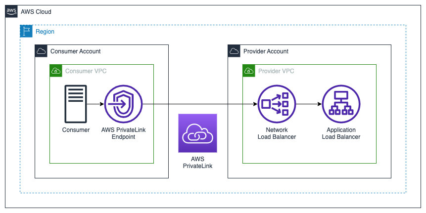

# AWS PrivateLink Reference Architectures

## Network Load Balancer -> Application Load Balancer

In this architecture, the provider has an existing Internet-facing ALB servicing existing consumers. The templates in this folder deploy a [Network Load Balancer](https://aws.amazon.com/elasticloadbalancing/network-load-balancer/) into private subnets within the same VPC and availabiilty zones (AZs) as the ALB. An NLB [target group](https://docs.aws.amazon.com/elasticloadbalancing/latest/network/load-balancer-target-groups.html) is created with the ALB as a single target. An AWS PrivateLink [endpoint service](https://docs.aws.amazon.com/vpc/latest/privatelink/create-endpoint-service.html) is created targeting the NLB.