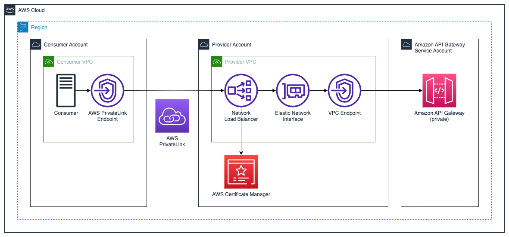

# AWS PrivateLink Reference Architectures

## Network Load Balancer -> Private API Gateway

In this architecture, the provider may have an existing edge or regional API Gateway or an existing [private API Gateway](https://docs.aws.amazon.com/apigateway/latest/developerguide/apigateway-private-apis.html) servicing existing consumers. A private API is required to provide connectivity through AWS PrivateLink. The templates in this folder deploy a [Network Load Balancer](https://aws.amazon.com/elasticloadbalancing/network-load-balancer/) into private subnets within the same VPC and availabiity zones (AZs) as the [interface VPC endpoint for API Gateway](https://docs.aws.amazon.com/apigateway/latest/developerguide/apigateway-private-apis.html#apigateway-private-api-create-interface-vpc-endpoint). An NLB [target group](https://docs.aws.amazon.com/elasticloadbalancing/latest/network/load-balancer-target-groups.html) is created with VPC endpoint elastic network interfaces (ENIs) as the TLS targets. [AWS Certificate Manager](https://aws.amazon.com/certificate-manager/) is used to create a TLS certificate that is associated to both the NLB and API Gateway.